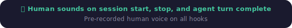
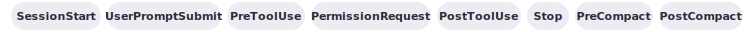

# Codex CLI Hooks
[](.codex/hooks/HOOKS-README.md) [-white?style=flat&labelColor=555)](https://github.com/openai/codex/releases) [](https://github.com/shanraisshan/codex-cli-hooks/stargazers) 

<p align="center">
  
</p>

<p align="center">
  
</p>

<p align="center">
  
</p>

## Installation

<p>
  <a href="install/README-mac.md"></a>&nbsp;
  <a href="install/README-linux.md"></a>&nbsp;
  <a href="install/README-windows.md"></a>
</p>


**Step 1.** Start Codex CLI with the hooks engine  enabled:
```bash
codex -c features.codex_hooks=true
```

**Step 2.** Send a prompt (e.g., `Hi`) — you'll hear a sound on session start, tool use, prompt submit, and session stop.

## Changelog
new hook addition changelogs only

| Date | Hooks | Changes | Codex CLI Version | Demo |
|------|:-----:|---------|:-----------------:|:----:|
| Mar 26, 2026 | 5 | Added `PreToolUse` and `PostToolUse` | [v0.117.0](https://github.com/openai/codex/releases) | |
| Mar 20, 2026 | 3 | Added `UserPromptSubmit` | [v0.116.0](https://github.com/openai/codex/releases) | |
| Mar 11, 2026 | 2 | Added `SessionStart` and `Stop` | [v0.115.0](https://github.com/openai/codex/releases) | |

## Links

<p>
  <a href="#"></a>&nbsp;
  <a href="#"></a>&nbsp;
  <a href="https://www.reddit.com/r/codex/comments/1rw6j0o/codex_cli_now_has_hooks_support_beta_sessionstart/"></a>&nbsp;
  <a href="https://x.com/shanraisshan/status/2033899318264856925"></a>&nbsp;
</p>

## Other Repos

<a href="https://github.com/shanraisshan/claude-code-hooks"></a> <a href="https://github.com/shanraisshan/claude-code-hooks"><strong>claude-code-hooks</strong></a> · <a href="https://github.com/shanraisshan/codex-cli-best-practice"></a> <a href="https://github.com/shanraisshan/codex-cli-best-practice"><strong>codex-cli-best-practice</strong></a> · <a href="https://github.com/shanraisshan/claude-code-best-practice"></a> <a href="https://github.com/shanraisshan/claude-code-best-practice"><strong>claude-code-best-practice</strong></a>

<p align="center">
  
</p>

##  Sponsor My Work

If you like my work, buy me a doodh patti 🍵 on

<a href="https://buy.polar.sh/polar_cl_fTn59g14xsMqJdXnPYtPmHVTdm6qnrNMnhXuB2JZJDL"></a> <a href="https://buy.polar.sh/polar_cl_fTn59g14xsMqJdXnPYtPmHVTdm6qnrNMnhXuB2JZJDL"><strong>Polar</strong></a>
